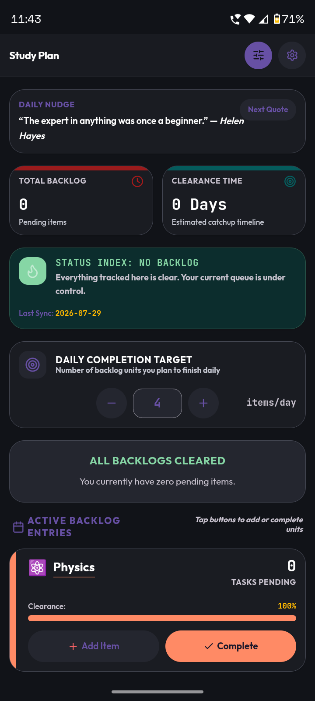
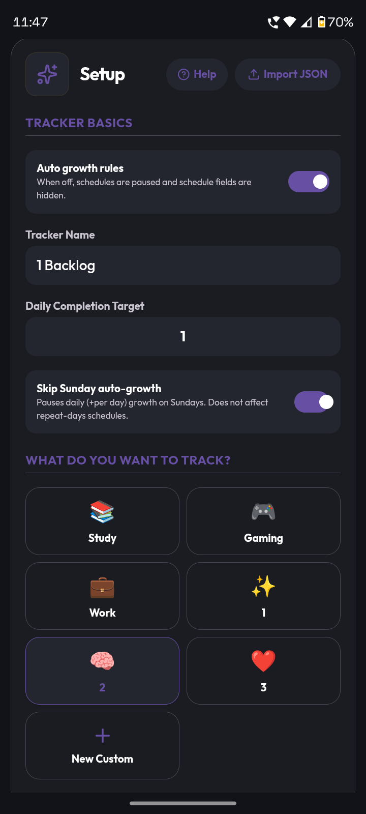
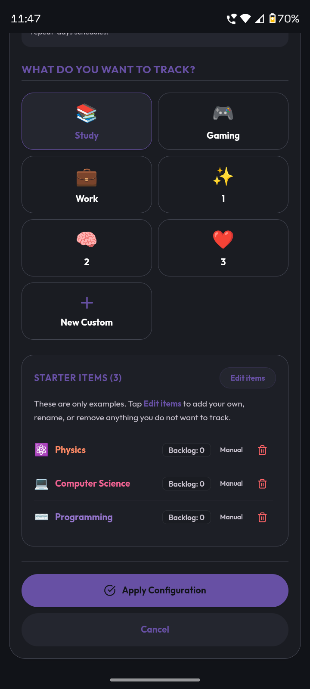
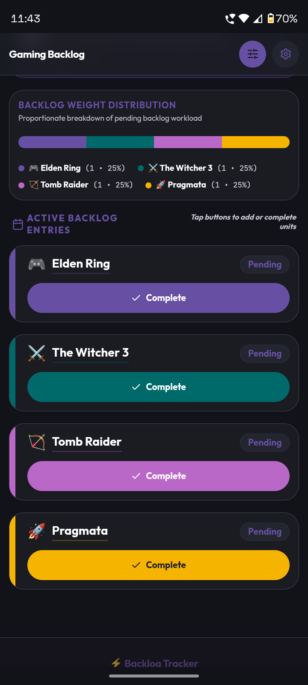
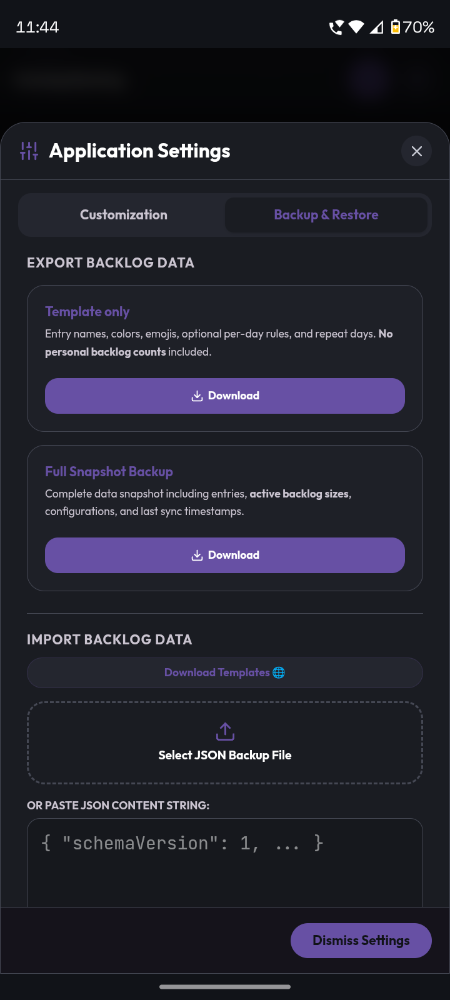
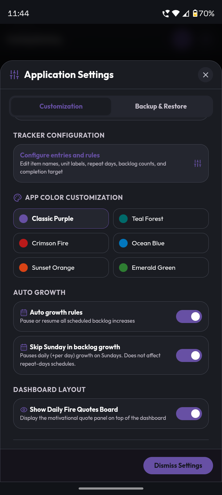

# Backlog Tracker

[](https://f-droid.org/packages/com.debojitsantra.backlogtracker/)


<p align="center">
  
</p>

Backlog Tracker is an offline-first app for Android and desktop. It tracks anything that piles up: study backlogs, work queues, games, habits, routines, or custom pending lists.

## Template Repo

Download tracker templates from:

[backlogdesigner.pages.dev](https://backlogdesigner.pages.dev) 

Source Repository: [Github](https://github.com/debojitsantra/BacklogTracker-Templates)


## Features

- Choose between count-based backlog mode and one-time task mode
- Add per-day or repeat-day automatic growth schedules
- Pause auto-growth when needed
- Estimate clearance time and finish date from your daily completion target
- Preview future backlog growth with the accumulation predictor
- Import and export JSON backups and shareable templates


## Screenshots
### Phone
<p align="center">
  
  
  
  
  
  

</p>

### Desktop

<p align="center">
  
  
  
  
</p>

## Tech Stack

- React 
- TypeScript
- Vite
- Tailwind CSS v4
- Motion
- Capacitor for android
- Tauri for desktop packaging

## Install

Download the latest GitHub release for your platform:

| Platform | Format / Install Options |
|----------|--------------------------|
| Windows  | [Winget](#windows-winget), [Setup.exe](https://github.com/debojitsantra/BacklogTracker/releases/), [MSI](https://github.com/debojitsantra/BacklogTracker/releases/) |
| Linux    | [APT Repository](#debianubuntu-apt-repository), [RPM Repository](#fedora-rpm-repository), [DEB](https://github.com/debojitsantra/BacklogTracker/releases/), [RPM](https://github.com/debojitsantra/BacklogTracker/releases/), [AppImage](https://github.com/debojitsantra/BacklogTracker/releases/) |
| macOS    | [DMG (aarch64)](https://github.com/debojitsantra/BacklogTracker/releases/) *(untested)* |
| Android  | [APK](https://github.com/debojitsantra/BacklogTracker/releases/) |

### Debian/Ubuntu APT Repository

```bash
curl -fsSL https://apt.110010101.xyz/public.key | \
sudo gpg --dearmor -o /usr/share/keyrings/debojitpackages.gpg

echo "deb [signed-by=/usr/share/keyrings/debojitpackages.gpg] https://apt.110010101.xyz stable main" | \
sudo tee /etc/apt/sources.list.d/debojitpackages.list

sudo apt update
sudo apt install backlog-tracker
```

### Fedora RPM Repository

```bash
sudo curl -o /etc/yum.repos.d/debojitsantra.repo https://rpm.110010101.xyz/debojitsantra.repo
sudo dnf install -y https://rpm.110010101.xyz/public.key

sudo dnf install backlog-tracker
```
<!--
### Windows Winget

```powershell
winget install DebojitSantra.BacklogTracker
```
-->

## App Stores

### Android

<a href="https://f-droid.org/packages/com.debojitsantra.backlogtracker">
    
</a>

### Windows

<a href="https://apps.microsoft.com/detail/9p112ngslvf0?referrer=appbadge&mode=full" target="_blank"  rel="noopener noreferrer">
	
</a>


## Local Development

### Prerequisites

- Node.js 22 or newer

### Run Web Dev Server

```bash
npm install
npm run dev
```

### Build Web Bundle

```bash
npm run build
```

## Android Build

### Prerequisites

- Android Studio
- Android SDK/build tools
- Java 21
- Node.js 22 or newer

### Build Steps

```bash
npm ci
npm run build
npx cap sync android
npx cap open android
```

Run from Android Studio, or use Gradle from the `android` directory.

## Desktop Builds


### Prerequisites

- Node.js 22 or newer
- Rust and Cargo

### Build Steps

```bash
npm ci
npm run tauri:build
```


## GitHub Actions

- `.github/workflows/build.yml` builds the signed Android release APK on version tags.
- `.github/workflows/desktop.yml` builds Linux, Windows, and macOS desktop artifacts with Tauri.


## Important Declaration

Documentation and some UI features were made using Gemini. Everything is reviewed manually before committing.
